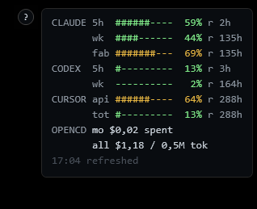

# usage-overlay

A tiny, always-on-top, click-through overlay for Windows that shows how much
of your AI coding-agent quota you have used. Bars are green under 60%, amber
from 60%, red from 85%, with a countdown to each window reset. On fetch
failures it keeps the last good numbers (shown amber) and retries. Click the
`?` button for a built-in legend.



| Section | Tool | Where the data comes from |
|---------|------|---------------------------|
| `CLAUDE` | Claude Code | `api.anthropic.com/api/oauth/usage`, using the OAuth token from `~/.claude/.credentials.json`. |
| `CODEX` | OpenAI Codex CLI | Last `rate_limits` event in the newest `~/.codex/sessions` log (local read). |
| `CURSOR` | Cursor | `cursor.com/api/usage-summary`, using the session token stored in Cursor's `state.vscdb`. |
| `OPENCD` | OpenCode | Local spend tracked in `opencode.db`, shown as $ spent (Zen has no quota API). |

The overlay only reads credentials and data those tools leave behind; it
never logs in for you. Node.js is required for the `CURSOR` and `OPENCD`
sections.

## Run / stop

```powershell
powershell -WindowStyle Hidden -File usage-overlay.ps1
powershell -File stop-overlay.ps1
```

## Configuration (optional)

Copy `config.example.json` to `config.json` and edit what you need. Missing
keys keep their defaults; `config.json` is git-ignored.

| Key | Values | Meaning |
|-----|--------|---------|
| `corner` | `top-right`, `top-left`, `bottom-right`, `bottom-left` | Screen corner the overlay docks to. |
| `marginX`, `marginY` | pixels | Distance from the work-area edge. |
| `refreshSeconds` | 15 or more | Redraw interval. Remote APIs are still polled only every 3rd tick. |
| `sections` | `"auto"` or e.g. `["claude", "codex"]` | `auto` shows only the tools with local data on this machine. |

## License

[MIT](LICENSE)
